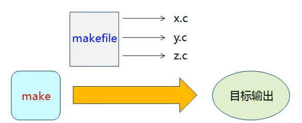
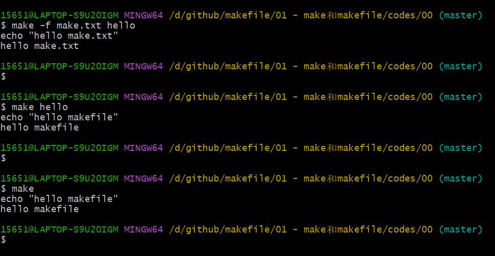
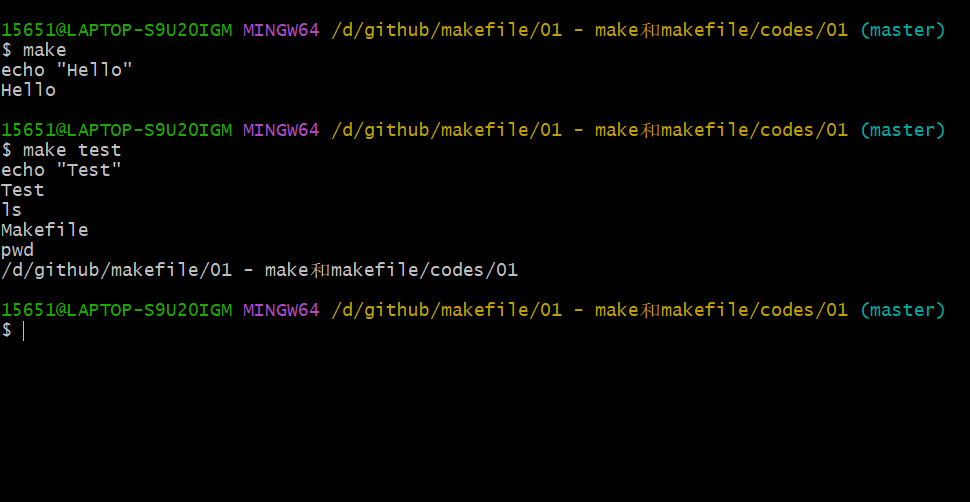

# 1. make 和 makefile

## 1.1 make 是一个应用程序

-- 解析源程序之间的 <font color=red>依赖关系</font>

-- 根据依赖关系 <font color=red>自动维护</font> 编译工作

-- 执行宿主操作系统中的各种命令

## 1.2 makefile 是一个描述文件

-- <font color=red>定义一系列的规则</font> 来指定源文件编译的先后顺序

-- 拥有 <font color=red>特定的语法规则</font>，支持函数定义和函数调用

-- 能够直接集成操作系统中的各种命令

## 1.3 make 和 makefile 之间的关系

makefile 中的描述用于指导 make 程序如何完成工作，make 根据 makefile 中的规则执行命令，最后完成编译输出




# 2. 最简单的 make 和 makefile 示例

## 2.1 makefile

```makefile
hello:
	echo "hello makfile"
```


- 注意：目标后的命令需要用 Tab 键（'\t'）隔开

## 2.2 make

```shell
make -f mf.txt hello
```

功能说明：以 hello 作为目标查找 mf.txt 文件，并执行 hello 处的命令。

## 2.3 make 程序的简写实例

1. 

```shell
make hello
```

功能说明：以 hello 为目标查找 makefile 或 Makefile 文件，并执行 hello 处的命令。

2. 

```shell
make
```

功能说明：查找 makefile 或 Makefile 文件中 <font color=red>最顶层目标</font>，并执行最顶层目标处的命令

# 3. 编程实验

[codes/00/make.txt](codes/00/make.txt)

[codes/00/makefile](codes/00/makefile)



[codes/01/Makefile](codes/01/Makefile)




