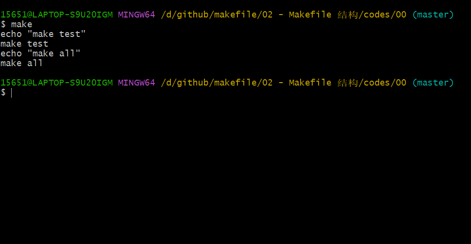
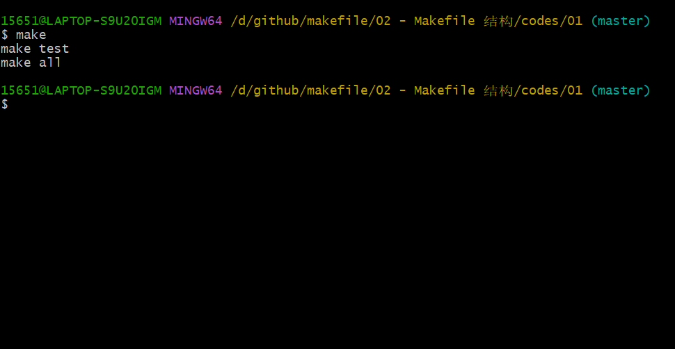
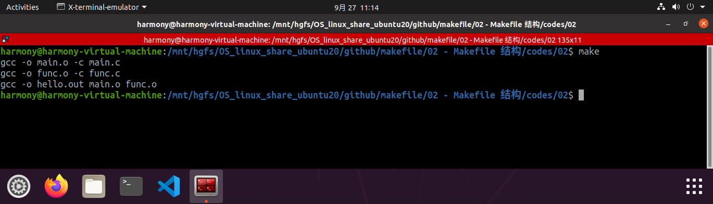

# 1. Makefile 的结构

## 1.1 Makefile 的意义

-- Makefile 用于定义源文件间的依赖关系

-- Makefile 说明如何编译各个源文件并生成可执行文件

## 1.2 Makefile 中的元素定义


```Makefile
targets：prerequisites ; command1
'\t' command2
```

### 1.2.1 targets

通常是需要生成的目标文件名

make 所需执行的命令名称

### 1.2.2 prerequisites

当前目标所依赖的其它目标或文件

### 1.2.3 command

完成目标所需要执行的命令

### 1.2.4 注意事项

1. targets 可以包含多个mubiao

使用空格对多个目标名进行分隔

2. prerequisites 可以包含多个依赖

使用空格对多个依赖进行分隔

3. [Tab] 键：\t

每一个命令行必须以 [Tab] 字符开始

[Tab] 字符告诉 make 此行是一个命令行

4. 续行符：\

可以将内容分开写到下一行，提高可读性


# 2. 依赖

## 2.1 一个 Makefile 的依赖示例

```Makefile
all: test
	echo "make all"

test:
	echo "make test"
```

[codes/00/Makefile](codes/00/Makefile)




## 2.2 依赖规则

当目标对应的文件不存在，执行此命令

当依赖在时间上比目标新，执行此命令

当依赖关系连续发生时，对比依赖链上的每一个目标

----

Makefile 中可以在命令前加上 @ 符号，作用为命令无回显

[codes/01/Makefile](codes/01/Makefile)

```Makefile
all: test
	@echo "make all"

test:
	@echo "make test"
```



----

# 3. 第一个 make 的编译案例

[codes/02/](codes/02/)

```Makefile
hello.out: main.o func.o
	gcc -o hello.out main.o func.o

main.o: main.c
	gcc -o main.o -c main.c

func.o: func.c
	gcc -o func.o -c func.c
```



----

工程开发中可以将最终 可执行文件名 和 all 同时作为 Makefile 中第一条规则的目标。

```Makefile
hello.out all : main.o func.o
	gcc -o hello.out main.o func.o
```

----

