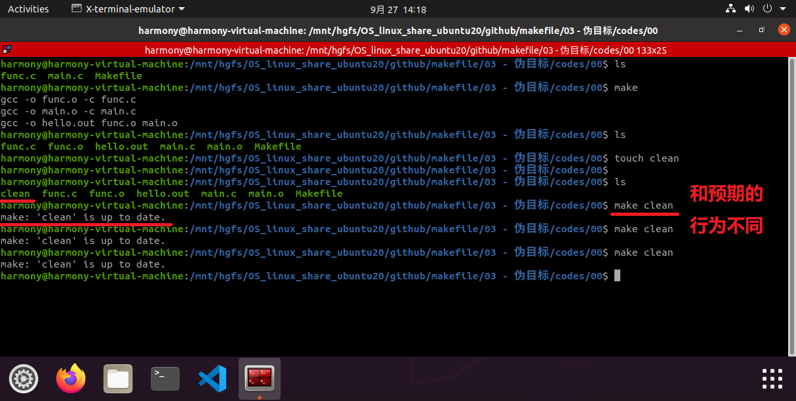
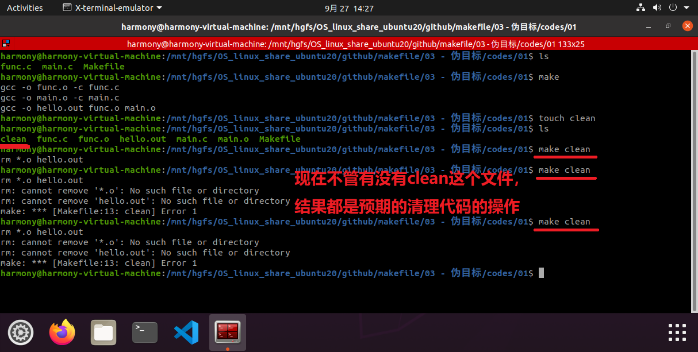
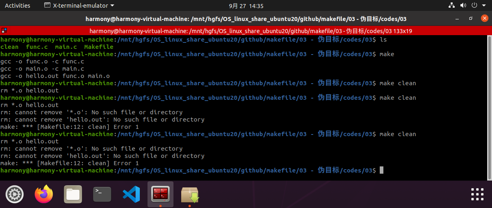

# 1. 思考

1. Makefile 中的 目标 究竟是什么？

---- 

默认情况下：

-- make 认为 目标 对应着一个文件

-- make 比较目标文件和依赖文件的新旧关系，决定是否执行命令

-- make 以文件处理作为第一优先级

----

2. 下面的代码有什么意义？

```makefile
hello.out all : func.o main.o
	gcc -o hello.out func.o main.o
	
func.o : func.c
	gcc -o func.o -c func.c
	
main.o : main.c
	gcc -o main.o -c main.c

clean :
	rm *.o hello.out
```

```shell
make clean
```

如果此时新建了一个名为 clean 的文件，make 以文件处理作为第一优先级，则会出现如下的现象，和我们预期要清理代码的行为不同：

[codes/00/](codes/00/)




# 2. 伪目标的引入

Makefile 中的伪目标：

-- 通过 .PHONY 关键字声明一个伪目标

-- 伪目标 不对应 任何实际的文件（如上述的 clean ）

-- <font size=5 color=red>不管伪目标的依赖是否更新，命令总是执行</font>

## 2.1 伪目标的语法：先声明，后使用

本质：伪目标是 make 中特殊目标 .PHONY 的依赖

```makefile
.PHONY: clean
clean:
	rm *.o hello.out
```

[codes/01/](codes/01/)



## 2.2 伪目标的妙用：规则调用（函数调用）

```makefile
.PHONY: clean rebuild all
rebuild: clean all
clean:
	rm *.o hello.out
```

原理：当一个目标的依赖包含伪目标时，伪目标所定义的命令总是会被执行

[codes/02/](codes/02/)


----

绕开 .PHONY 关键字定义伪目标

原理：如果一个规则没有命令或者依赖，并且它的目标不是一个存在的文件名，在执行此规则时，目标总会被认为时最新的。

```makefile
clean: FORCE
	rm *.o hello.out
FORCE:
```

[codes/03](codes/03)



----
