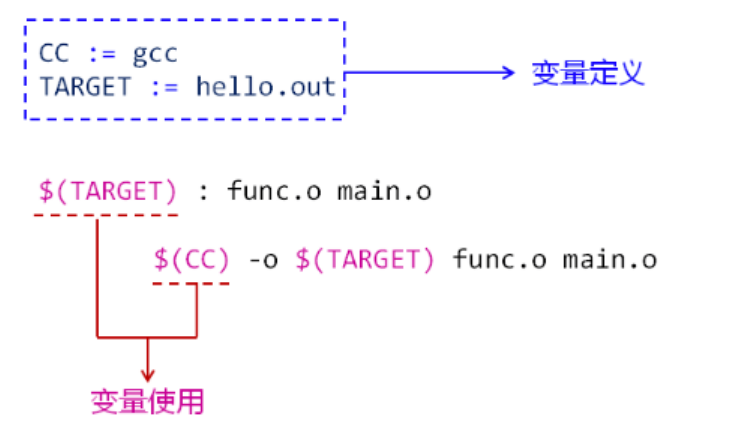
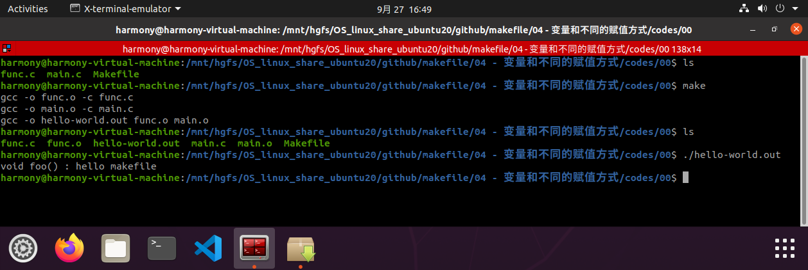
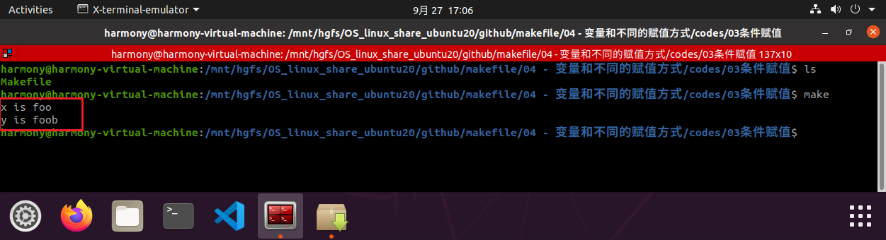
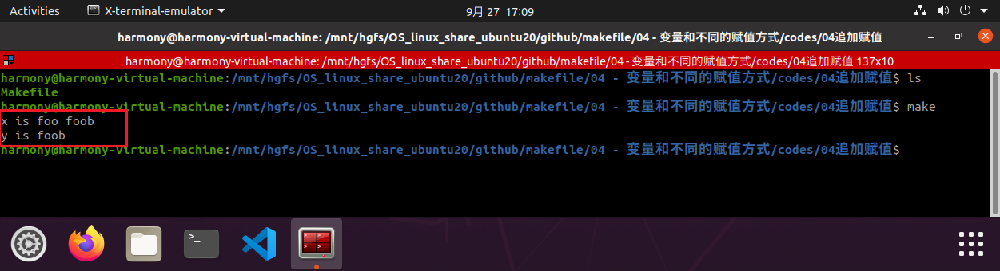

# 1. 变量

Makefile 中支持程序设计语言中 变量 的概念

Makefile 中的变量 只代表文本数据（字符串）

Makefile 中的变量命名规则：

-- 变量名可以包含字符、数字、下划线

-- 不能包含 : 、# 、= 或 空格

-- 变量名大小写敏感

## 1.1 变量的定义和使用



## 1.2 实验

```makefile
CC := gcc
TARGET := hello-world.out

$(TARGET) : func.o main.o
	$(CC) -o $(TARGET) func.o main.o
	
func.o : func.c
	$(CC) -o func.o -c func.c
	
main.o : main.c
	$(CC) -o main.o -c main.c

.PHONY: rebuild clean all

rebuild: clean all

all: $(TARGET)

clean :
	rm *.o hello.out	
```

[codes/00](codes/00/)



# 2. Makefile 中变量的赋值方式

简单赋值 :=

递归赋值 =

条件赋值 ?=

追加赋值 +=

（不同的赋值方式意义不同）

## 2.1 简单赋值（ := ）

程序设计中的通用的赋值方式

只针对当前语句的变量有效


## 2.2 递归赋值（ = ）

赋值操作可能影响多个其它变量

所有与目标变量相关的其它变量都将受到影响


## 2.3 条件赋值（ ?= ）

如果变量未定义，使用赋值符号中的值定义变量

如果变量已经定义，赋值无效



## 2.4 追加赋值（ += ）

原变量值之后加上一个新值

原变量值与新值之间由空格隔开



